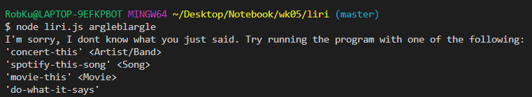
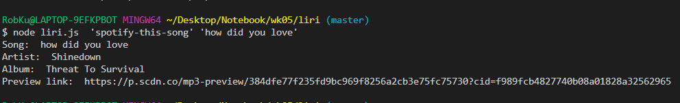
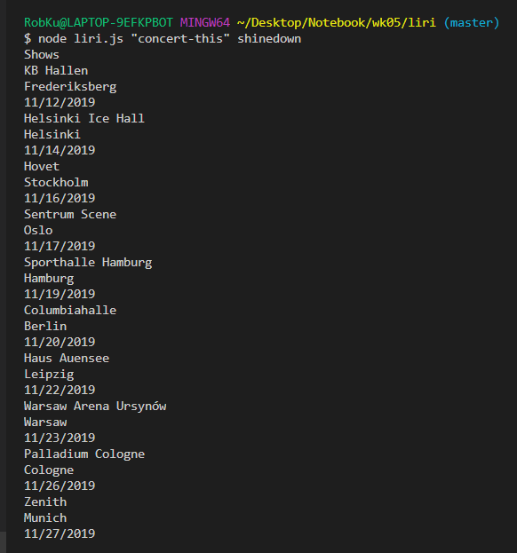
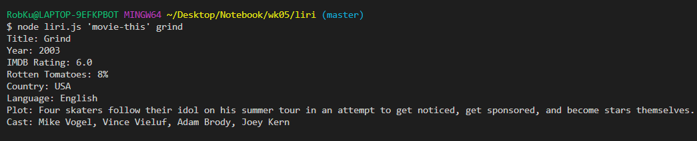
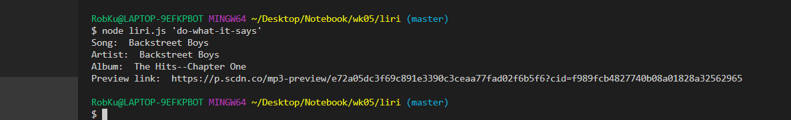
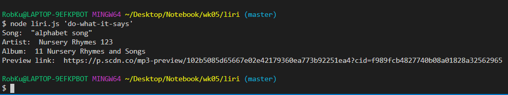

# liri

Let's be honest; we're all here for the same reason. We are here to pay tribute to the best song ever written (or maybe just the one stuck in my head at the moment) "How did you love" by Shinedown. Seriously, it's been looping through my head for days now. hopefully this will exorcise the demon. And if it transmits to you instead, well that's just too bad!

#dependencies: Paste this single line into your terminal;
npm i axios dotenv moment node-spotify-api spotify

# Usage
When `node liri.js` is run without any arguments, Liri responds with a helpful list of options the user can use to look up "How did you love"  
  
When run with `spotify-this-song` and a song name, it returns information on that song. Here we'll use "How did you love", by Shinedown  .
  
When run with `concert-this` and an artist name, it returns upcoming shows that artist is playing. For example, the user could look up Shinedown, of the hit song "How did you love"!  
   
When run with `movie-this` and a movie name, it returns OMDB info on that movie. How about "Grind"? I've never seen it, but apparently it has music on its soundtrack from Shinedown, of the hit song "How did you love"!  
   
And finally, running Liri with `do-what-it-says` returns code from an external file.   
   
You know what? The Backstreet Boys were terrible. I've got a better song to show. I expect by now you can guess what it is...   
   
That's right, THE ALPHABET SONG!  
 
